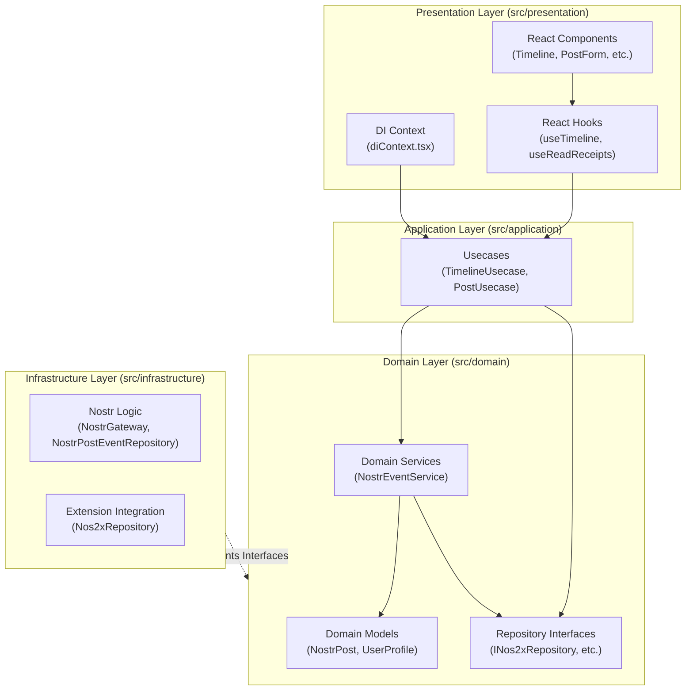

# Nostr Client

- このリポジトリは、**React**、**TypeScript**、**Vite** で構築されたウェブベースの**Nostrクライアント**です。
- `nostr-protocol`を活用し、分散型ソーシャルネットワークとしての短いテキストノートの取得や投稿といった機能を提供します。

## 採用技術 (Core Technologies)
- **フロントエンド:** React 19 (TypeScript)
- **UIライブラリ:** Material UI (MUI) v7 (カスタムスタイリングにはEmotionを使用)
- **Nostr連携:** `nostr-tools`, `nostr-wasm`
- **ビルドシステム:** Vite 8
- **ツール:** Biome (リンティング・フォーマット処理用)
- **主要言語:** TypeScript (プロジェクトコードの97.7%を占有)

## 🏗 アーキテクチャ (Architecture)

- ビジネスロジックを外部の依存関係から切り離すため、レイヤードアーキテクチャを採用しています。



各層の役割は以下の通りです

- src/domain: コアとなるビジネスロジックとデータ構造（エンティティ、リポジトリのインターフェース、ドメインサービス）を格納します
- src/application: アプリケーション固有のビジネスルール（ユースケース）の調整を行います
- src/infrastructure: 外部システムの実装詳細（Nostrリレーとの通信やブラウザ拡張機能の統合）を担います
- src/presentation: ユーザーインターフェース、状態管理、および依存性の注入（DIコンテキスト）を担当します

## 🚀 ビルドと実行 (Building and Running)

- パッケージ管理には pnpm を使用しています
- 以下のコマンドを使用して開発およびビルドを行います

### 開発サーバーの起動 (Vite dev server)
```bash
npm run dev
```

### 本番環境向けの型チェックとビルド
```bash
npm run build
```

### 本番ビルドのローカルプレビュー
```bash
npm run preview
```

### リンターの実行 (Biomeによるチェック)
```bash
npm run lint:check
```

### フォーマッターの実行

```bash
npm run format:check   # フォーマットの確認
npm run format:write   # フォーマットの修正
```

## 🔑 開発の決まり事と必須要件 (Conventions & Requirements)

- Nostr拡張機能: クライアントは window.nostr を介したイベント署名に依存しているため、nos2x または Alby といったブラウザ拡張機能が必要です

- 言語・型付け: 厳密な型付け（Strict typing）の TypeScript を推奨しています。ドメインモデルは src/domain/model に定義されたものを使用してください

- コードスタイル: インデントにはタブ、引用符にはダブルクォーテーションを使用します。インポートの整理を含め、これらは Biome により自動管理されています

- 状態管理とDI: ローカルステートには React Hooks を多用し、ユースケースへの依存性の注入（DI）には React Context (DIContext, useDI) を使用しています

📁 主要なファイル構成 (Key Files)

- src/main.tsx: アプリケーションのエントリーポイント。Wasmを初期化し、AppをDIProviderでラップします

- src/App.tsx: グローバル状態とレイアウトを管理するルートコンポーネントです

- src/presentation/context/diContext.tsx: リポジトリ、サービス、ユースケースを構成するDIコンテナです

- src/infrastructure/nostr/nostrPostEventRepository.ts: nostr-toolsを介してNostrリレーでのイベント購読・公開を行うメインロジックです
  
- src/domain/service/nostrEventService.ts: インフラ層へ送信する前の、投稿やリアクションに関するドメインロジックを処理します