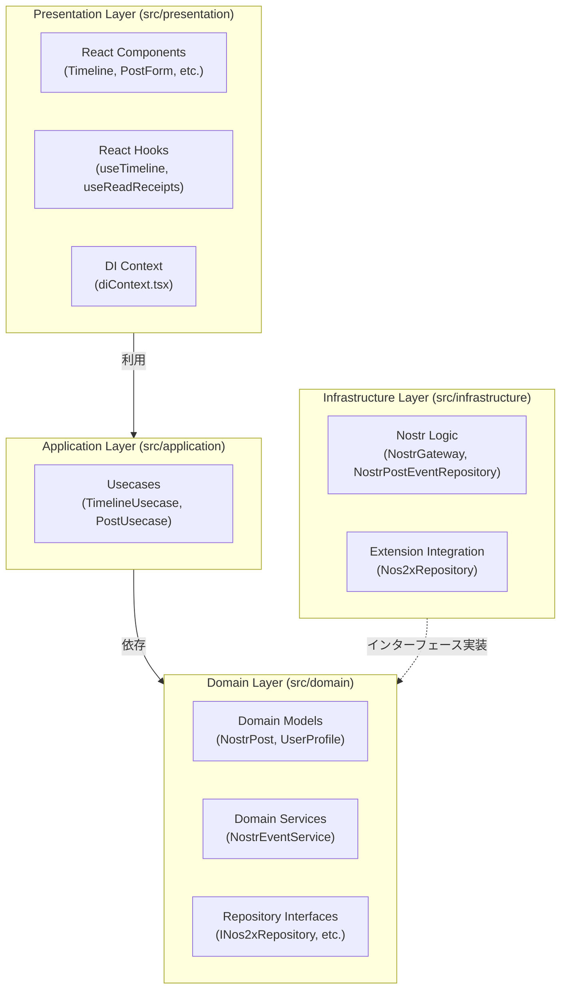

# Nostr Client

- React、TypeScript、Viteで構築されたWebベースのNostrクライアント
- 分散型ソーシャルネットワークとしてのテキストノートの取得・投稿機能を提供
- Zustandを用いた認証システムやNIP-07（ブラウザ拡張機能）のサポート

## 🛠️ 採用技術 (Core Technologies)

- **フロントエンド:** React 19 (TypeScript)
- **状態管理:** Zustand (認証システム等に利用)
- **UIライブラリ:** Material UI (MUI) v7, Emotion (カスタムスタイリング)
- **Nostr連携:** nostr-tools, nostr-wasm (抽象プールとWASMサポート)
- **ビルドシステム:** Vite 8
- **ツール:** Biome (リンティング・フォーマット処理用)
- **パッケージ管理:** pnpm

## 🏗 アーキテクチャ (Architecture)

ビジネスロジックを外部の依存関係から切り離すため、クリーンアーキテクチャに基づく**レイヤードアーキテクチャ**を採用しています。

### 各層の役割

- Domain Layer (src/domain): コアとなるビジネスロジック、データ構造（エンティティ）、リポジトリのインターフェース、ドメインサービスを格納します。
- Application Layer (src/application): アプリケーション固有のビジネスルール（ユースケース）の調整を行います。
- Infrastructure Layer (src/infrastructure): Nostrリレーとの通信やブラウザ拡張機能の統合など、外部システムの実装詳細を担います。
- Presentation Layer (src/presentation): ユーザーインターフェース、状態管理（Zustand、React Hooks）、および依存性の注入（DIコンテキスト）を担当します。

### 📁 主要なファイル構成 (Key Files)

- src/main.tsx: アプリケーションのエントリーポイント。Wasmを初期化し、AppをDIProviderでラップします。
- src/App.tsx: グローバル状態とレイアウトを管理するルートコンポーネントです。
- src/presentation/context/diContext.tsx: リポジトリ、サービス、ユースケースを構成するDIコンテナです。
- src/infrastructure/nostr/nostrPostEventRepository.ts: nostr-toolsを介してNostrリレーでのイベント購読・公開を行うメインロジックです。
- src/domain/service/nostrEventService.ts: インフラ層へ送信する前の、投稿やリアクションに関するドメインロジックを処理します。

### 🔑 開発の決まり事と必須要件 (Conventions & Requirements)

- Nostr拡張機能: クライアントはNIP-07（window.nostr）を介したイベント署名に依存しているため、nos2xやAlbyといったブラウザ拡張機能が必要です。
- 言語・型付け: 厳密な型付け（Strict typing）のTypeScriptを推奨しています。ドメインモデルは src/domain/model に定義されたものを使用してください。
- コードスタイル: インデントにはタブ、引用符にはダブルクォーテーションを使用します。これらはBiomeにより自動管理されます。
- DI (依存性の注入): ユースケースへの依存性の注入にはReact Context (DIContext, useDI) を使用しています。

### 🚀 ビルドと実行 (Building and Running)

パッケージ管理には pnpm を使用します。
package.json には以下の用途向けコマンドが定義されています。

- 開発サーバーの起動 (Vite dev server)
- 本番環境向けの型チェックとビルド
- 本番ビルドのローカルプレビュー
- リンターの実行 (Biomeによるチェック)
- フォーマッターの実行
