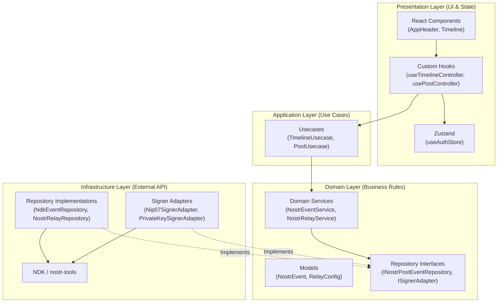

# Nostr Client

- React、TypeScript、Viteで構築されたWebベースのNostrクライアント
- 分散型ソーシャルネットワークとしてのテキストノートの取得・投稿機能を提供
- Zustandを用いた認証システムやNIP-07（ブラウザ拡張機能）のサポート

## 🛠️ 採用技術 (Core Technologies)

- **フロントエンド:** React 19 (TypeScript)
- **状態管理:** Zustand (認証システム等に利用)
- **UIライブラリ:** Material UI (MUI) v7, Emotion (カスタムスタイリング)
- **Nostr連携:** @nostr-dev-kit/ndk, @nostr-dev-kit/react, nostr-tools, nostr-wasm (抽象プールとWASMサポート)
- **ビルドシステム:** Vite 8
- **ツール:** Biome (リンティング・フォーマット処理用)
- **パッケージ管理:** pnpm

## 🏗 アーキテクチャ (Architecture)

ビジネスロジックを外部の依存関係から切り離すため、クリーンアーキテクチャに基づく**レイヤードアーキテクチャ**を採用しています。



### 各層の役割

​- Presentation Layer: UIコンポーネントの描画、カスタムフックを通じた操作のハンドリング、およびZustandによる状態管理を担当します。
- ​Application Layer: ユーザーの操作に対するユースケース（タイムラインの取得や投稿など）の進行を管理し、ドメイン層のサービスを呼び出します。
- ​Domain Layer: アプリケーションのコアとなるエンティティやビジネスルール、およびインフラストラクチャ層が実装すべきインターフェースを定義します。
- ​Infrastructure Layer: nostr-tools や NDK を用いたNostrリレーとの実際の通信、NIP-07ブラウザ拡張機能との連携など、具体的な技術実装を担当します。

### 📁 主要なファイル構成 (Key Files)

```
src/
├── application/     # ユースケースクラスの実装
├── domain/          # エンティティ、ドメインサービス、リポジトリインターフェース
├── infrastructure/  # Nostr通信ロジックや署名アダプターの具体的な実装
├── presentation/    # Reactコンポーネント、Hooks、状態管理
├── App.tsx          # グローバル状態・レイアウトを管理するルート
├── main.tsx         # エントリーポイント（Wasm初期化等）
└── style.css        # グローバルスタイル

```

### 🔑 開発の決まり事と必須要件 (Conventions & Requirements)

- Nostr拡張機能: クライアントはNIP-07（window.nostr）を介したイベント署名に依存しているため、nos2xやAlbyといったブラウザ拡張機能が必要です。
- 言語・型付け: 厳密な型付け（Strict typing）のTypeScriptを推奨しています。ドメインモデルは src/domain/model に定義されたものを使用してください。
- コードスタイル: インデントにはタブ、引用符にはダブルクォーテーションを使用します。これらはBiomeにより自動管理されます。
- DI (依存性の注入): ユースケースへの依存性の注入にはReact Context (DIContext, useDI) を使用しています。

### 👮🏼 認証・ログイン機能 (Authentication)

#### サポートされる認証方式

1. **NIP-07 ブラウザ拡張機能（推奨）**
   - nos2x、Alby等の拡張機能を使用
   - 秘密鍵をアプリケーションに公開せずに署名を実行
   - 拡張機能が提供するリレー設定も自動取得

2. **秘密鍵直接入力（nsec/hex形式）**
   - nsec形式（bech32エンコード）またはhex形式（64文字）に対応
   - 秘密鍵は揮発性メモリ（Zustand）にのみ保存
   - ページリロード時にセッションが破棄される（セキュリティ設計）
   - localStorage/sessionStorageには保存されない

#### セキュリティ設計

- **揮発性メモリ管理**: 秘密鍵は Zustand ストア内のメモリにのみ保存され、ブラウザストレージには永続化されません
- **エラーメッセージのサニタイズ**: エラーメッセージに秘密鍵の内容を含めない設計
- **バリデーション**: 入力された秘密鍵の形式チェック（nsec/hex）
- **ローディング状態**: ログイン処理中はUIをdisabledにし、多重リクエストを防止

### 🚀 ビルドと実行 (Building and Running)

パッケージ管理には pnpm を使用します。
package.json には以下の用途向けコマンドが定義されています。

- 開発サーバーの起動 (Vite dev server)
- 本番環境向けの型チェックとビルド
- 本番ビルドのローカルプレビュー
- リンターの実行 (Biomeによるチェック)
- フォーマッターの実行
